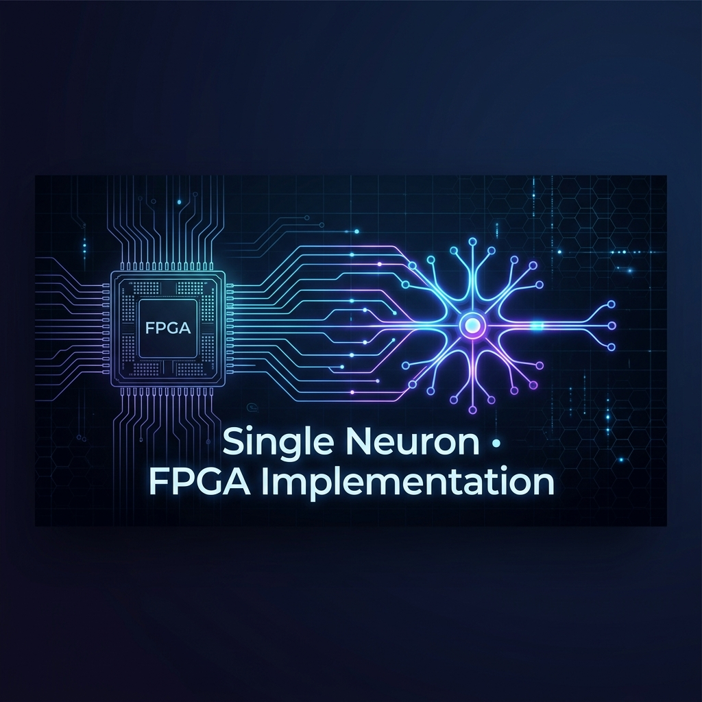
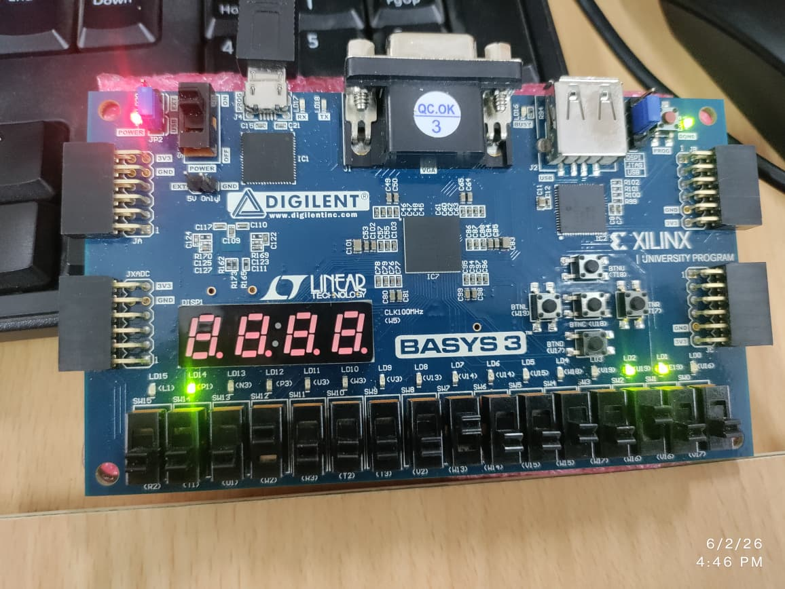

<p align="center">
  
</p>

<h1 align="center">⚡ Single Neuron — FPGA Hardware Implementation</h1>

<p align="center">
  <strong>A pipelined, fixed-point artificial neuron synthesized and deployed on a Xilinx Artix-7 FPGA (Basys 3)</strong>
</p>

<p align="center">
  
  
  
  
  
</p>

---

## 🧠 Overview

This project implements a **fully synthesizable artificial neuron** in **Verilog HDL**, targeting the **Digilent Basys 3 (Xilinx Artix-7 XC7A35T)** FPGA. It demonstrates the fundamental computational primitive of neural networks — the **Multiply-Accumulate (MAC) + Activation** pipeline — entirely in digital hardware, bridging the gap between AI/ML algorithms and silicon-level execution.

> **Why this matters:** As the industry pivots toward **edge AI**, **neuromorphic processors**, and **TinyML accelerators**, understanding how a single neuron maps to hardware is the foundational skill behind architectures like Google's TPU, Intel's Loihi, IBM's TrueNorth, and AMD-Xilinx's DPU.

---

## 🏗️ Architecture

```
                    ┌─────────────────────────────────────────────┐
                    │           top_neuron_project                │
                    │                                             │
  clk_100MHz ──────►  ┌──────────────┐    ┌───────────────────┐  │
                    │  │  clk_divider │    │  single_neuron    │  │
                    │  │  100MHz→1Hz  ├───►│  (Equal Weights)  ├──┼──► out_equal [4:0]
                    │  └──────────────┘    │  W=[1,1,1] B=1    │  │
                    │         │            └───────────────────┘  │
  x0[3:0] ─────────┼─────────┼───────────────────────┐          │
  x1[3:0] ─────────┼─────────┼───────────────────────┤          │
  x2[3:0] ─────────┼─────────┼───────────────────────┤          │
                    │         │            ┌──────────┴────────┐  │
                    │         └───────────►│  single_neuron    │  │
                    │                      │  (Unequal Wts)    ├──┼──► out_unequal [4:0]
  rst ──────────────┼─────────────────────►│  W=[1,2,3] B=0   │  │
                    │                      └───────────────────┘  │
                    └─────────────────────────────────────────────┘
```

### Neuron Micro-Architecture (2-Stage Pipeline)

| Stage | Operation | Cycle | Details |
|:------|:----------|:-----:|:--------|
| **Stage 1** | Parallel Multiplication | T | 3× signed multiply: `prod_i = x_i × W_i` (4-bit × 8-bit → 12-bit) |
| **Stage 2** | Accumulation + ReLU | T+1 | `sum = Σprod_i + bias` → ReLU activation with saturation guard [0, +15] |

```
         ┌────────┐     ┌────────┐     ┌────────┐
x0 ─────►│ × W0   ├──┐  │        │     │        │
         └────────┘  ├─►│  Σ + B ├────►│ ReLU   ├────► neuron_out [4:0]
x1 ─────►│ × W1   ├──┤  │        │     │ Clamp  │
         └────────┘  │  └────────┘     │ [0,15] │
x2 ─────►│ × W2   ├──┘                └────────┘
         └────────┘
      Pipeline Reg          Pipeline Reg
      (12-bit signed)       (5-bit signed)
```

---

## 🔑 Key Technical Highlights

### 🚀 Trending Industry Skills Demonstrated

| Skill Area | Implementation Detail | Industry Relevance |
|:-----------|:----------------------|:-------------------|
| **Neuromorphic Computing** | Hardware neuron with biological-inspired MAC + activation | Core to Intel Loihi, IBM TrueNorth, BrainChip Akida |
| **AI/ML Hardware Acceleration** | Fixed-point MAC pipeline — the atomic unit of every neural accelerator | Foundation of Google TPU, NVIDIA DLA, AMD-Xilinx DPU |
| **Pipelined Datapath Design** | 2-stage registered pipeline for deterministic throughput | Essential for high-frequency ASIC/FPGA design roles |
| **Fixed-Point Arithmetic** | Signed fixed-point multiply-accumulate with overflow protection | Industry standard for edge AI (avoids costly FPU) |
| **RTL Design & Verification** | Parameterized Verilog modules with comprehensive testbench | Core competency at any semiconductor company |
| **FPGA Prototyping** | End-to-end synthesis, P&R, and hardware validation on Basys 3 | Rapid prototyping skills used at AMD, Intel, Qualcomm |
| **Clock Domain Engineering** | Programmable clock divider (100MHz → 1Hz) for real-time observation | Critical for multi-clock SoC design |

### 🛡️ Design Robustness Features

- **Saturation Guard (Overflow Protection):** Output is hardware-clamped to `[0, +15]` — prevents silent arithmetic overflow, a critical reliability feature in safety-critical AI inference hardware.
- **ReLU Activation in Hardware:** The most widely used activation function in modern deep learning, implemented as a zero-cost combinational comparator — no DSP slices consumed.
- **Parameterized Weights & Bias:** Weights and bias are compile-time configurable via Verilog `parameter`, enabling rapid architectural exploration without RTL modification.
- **Dual-Instance Comparative Architecture:** Two neuron instances with different weight configurations run in parallel, enabling real-time behavioral comparison on hardware.

---

## 📂 Repository Structure

```
Single_neuron_implementation/
├── README.md                      # This file
├── rtl/
│   └── single_neuron.v            # RTL source — clock divider + neuron + top wrapper
├── tb/
│   └── tb_neuron.v                # Simulation testbench with parameterized clock override
├── docs/
│   ├── FPGA_RESULTS.jpeg          # Hardware deployment photo (Basys 3)
│   └── architecture.pptx          # Detailed architecture presentation
└── constraints/
    └── basys3.xdc                 # Pin mapping constraints (user-supplied)
```

---

## ⚙️ Build & Run

### Prerequisites
- **Xilinx Vivado** 2020.2 or later (WebPACK edition is sufficient)
- **Digilent Basys 3** FPGA board (Artix-7 XC7A35T-1CPG236C)

### Simulation (Vivado Behavioral Sim)
```tcl
# In Vivado Tcl Console
create_project neuron_sim ./neuron_sim -part xc7a35tcpg236-1
add_files rtl/single_neuron.v
add_files -fileset sim_1 tb/tb_neuron.v
launch_simulation
run all
```

### Synthesis & Hardware Deployment
```tcl
# Synthesize, implement, and generate bitstream
launch_runs synth_1 -jobs 4
wait_on_run synth_1
launch_runs impl_1 -to_step write_bitstream -jobs 4
wait_on_run impl_1

# Program the Basys 3
open_hw_manager
connect_hw_server
program_hw_devices [lindex [get_hw_devices] 0]
```

### I/O Mapping (Basys 3)

| Signal | Direction | Basys 3 Mapping | Description |
|:-------|:---------:|:----------------|:------------|
| `x0[3:0]` | Input | Switches SW[3:0] | 4-bit signed input 0 |
| `x1[3:0]` | Input | Switches SW[7:4] | 4-bit signed input 1 |
| `x2[3:0]` | Input | Switches SW[11:8] | 4-bit signed input 2 |
| `rst` | Input | Button BTNC | Active-high system reset |
| `out_equal[4:0]` | Output | LEDs LD[4:0] | Equal-weight neuron result |
| `out_unequal[4:0]` | Output | LEDs LD[9:5] | Unequal-weight neuron result |

---

## 🧪 Verification Results

### Test Case 1: Positive Inputs `(x0=2, x1=2, x2=3)`

| Neuron Instance | Weight Config | Computation | Expected | Status |
|:----------------|:-------------|:------------|:--------:|:------:|
| Equal Weights | W=[1,1,1], B=1 | (2×1)+(2×1)+(3×1)+1 = **8** | 8 | ✅ |
| Unequal Weights | W=[1,2,3], B=0 | (2×1)+(2×2)+(3×3)+0 = **15** | 15 | ✅ |

### Test Case 2: Negative Inputs — ReLU Validation `(x0=-3, x1=-4, x2=1)`

| Neuron Instance | Weight Config | Computation | ReLU Output | Status |
|:----------------|:-------------|:------------|:-----------:|:------:|
| Equal Weights | W=[1,1,1], B=1 | (-3)+(-4)+(1)+1 = **-5** → ReLU → **0** | 0 | ✅ |
| Unequal Weights | W=[1,2,3], B=0 | (-3)+(-8)+(3)+0 = **-8** → ReLU → **0** | 0 | ✅ |

### Hardware Deployment

<p align="center">
  
  <br/>
  <em>Live hardware validation on Digilent Basys 3 — LEDs displaying neuron output in real-time</em>
</p>

---

## 🔬 Technical Deep-Dive

### Why Fixed-Point over Floating-Point?

| Metric | Floating-Point (FP32) | This Design (Fixed-Point) |
|:-------|:---------------------:|:-------------------------:|
| Multiplier Area | ~2,000 LUTs | ~48 LUTs |
| Latency | 3-6 cycles | 1 cycle |
| Power | High | Ultra-low |
| DSP Slices | Required | **None** |
| Edge AI Suitability | ❌ Overkill | ✅ Optimal |

> Fixed-point inference is the **industry standard** for deploying neural networks on edge devices. Google's Edge TPU, Apple's Neural Engine, and Qualcomm's Hexagon DSP all use fixed-point or integer-only arithmetic.

### Neuron Equation

The implemented neuron computes:

```
y = ReLU(Σ(xᵢ × Wᵢ) + b)

where:
  ReLU(z) = max(0, min(z, 15))    // Clamped ReLU for 5-bit output
  xᵢ ∈ [-8, +7]                   // 4-bit signed inputs
  Wᵢ ∈ [-128, +127]               // 8-bit signed weights (parameterized)
  b  ∈ [-128, +127]               // 8-bit signed bias (parameterized)
  y  ∈ [0, +15]                   // 5-bit saturated output
```

---

## 🗺️ Roadmap & Extensibility

This single neuron is the **atomic building block** for larger neuromorphic systems:

```
Single Neuron (this project)
    │
    ├──► Multi-Neuron Layer (parallel neuron array)
    │       │
    │       ├──► Multi-Layer Perceptron (MLP) on FPGA
    │       │
    │       └──► Convolutional Neural Network (CNN) accelerator
    │
    └──► Spiking Neural Network (SNN) neuron
            │
            └──► Neuromorphic Processor (e.g., PHENICS architecture)
```

- [x] Single neuron with MAC + ReLU
- [x] Parameterized weights and bias
- [x] Hardware validation on Basys 3
- [ ] Multi-neuron fully-connected layer
- [ ] On-chip weight loading via UART/SPI
- [ ] Batch normalization hardware block
- [ ] Integration with AXI-Stream for SoC deployment

---

## 🏷️ Tags & Keywords

`FPGA` `Verilog` `Neuromorphic-Computing` `AI-Hardware-Accelerator` `Edge-AI` `Neural-Network` `RTL-Design` `Xilinx` `Artix-7` `Basys-3` `Fixed-Point-Arithmetic` `MAC-Unit` `ReLU` `Pipelined-Architecture` `Digital-Design` `Hardware-Verification` `TinyML` `Inference-Engine` `ASIC-Prototyping`

---

## 📄 License

This project is licensed under the [MIT License](LICENSE).

---

<p align="center">
  <strong>Built with ❤️ on real silicon — not just simulation.</strong>
  <br/>
  <em>If you found this useful, a ⭐ on the repo goes a long way!</em>
</p>
